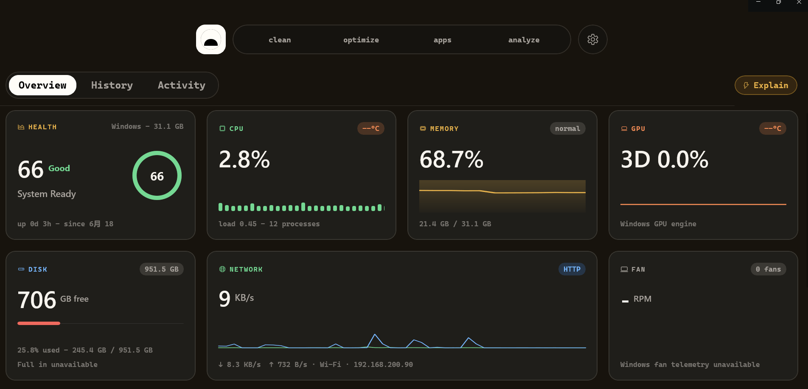
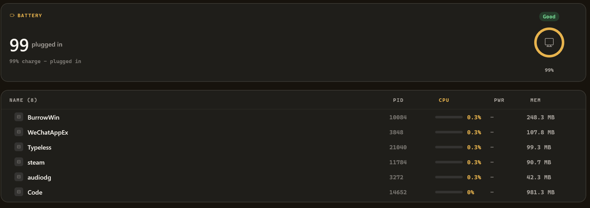
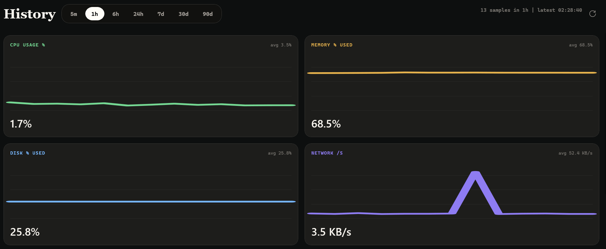
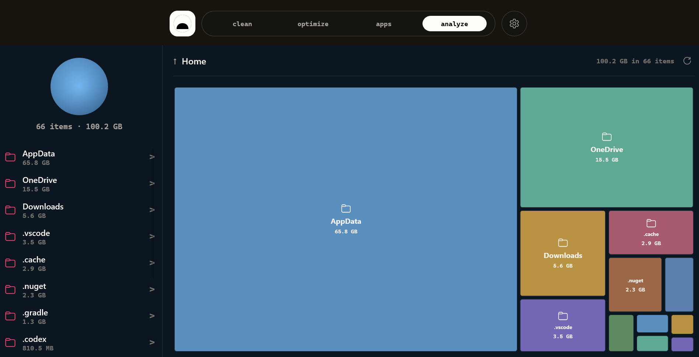
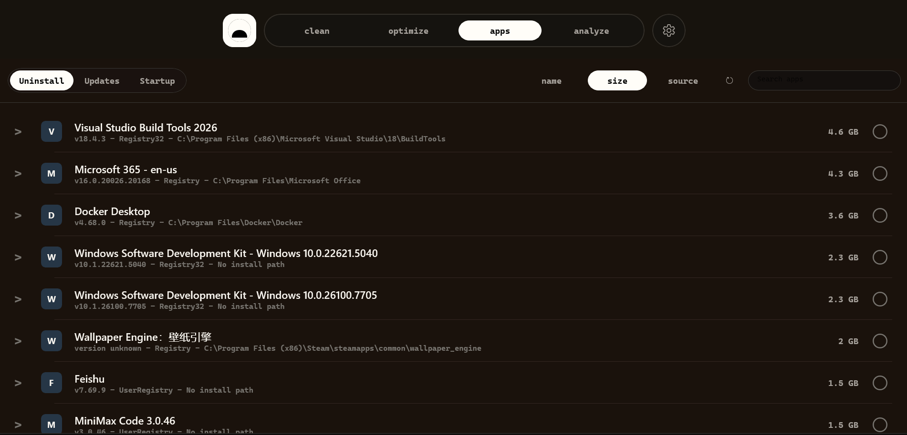

> Burrow is an independent open-source project built on the same `mo` engine
> as [mole.fit](https://mole.fit/) (the official Mole for Mac app by `mo`'s author),
> but it is **not affiliated with or endorsed by mole.fit** — its own name,
> mark, palette, and copy are original. 
>
> If you want it and to fund `mo`'s development — **buy mole.fit ($19)**.

# Burrow

**A free, open-source GUI for the [Mole](https://github.com/tw93/Mole) (`mo`) engine — clean, uninstall, optimize, analyze disk, and watch live system status. Plus long-range history and local MCP access for AI agents. Native on macOS, with a Windows preview implemented under [`windows/`](windows/).**


Burrow wraps the free, open-source Mole engine in a native desktop app: clean
junk, purge dev artifacts, sweep leftover installers, uninstall apps, run safe
maintenance, map your disk, and watch live system status — in one window. On top
of that it adds things the CLI doesn't have: a **long-running history** of your
machine's metrics in a local store and an **MCP server** so any AI agent (Claude
Code, Cursor, Codex…) can ask "what's been happening on this machine."

**macOS** is the mature flagship. **Windows** currently has a native WinUI 3 /
.NET 8 preview app, Windows telemetry/history, tray HUD, loopback HTTP, MCP
stdio bridge, CI, tests, and unsigned release packaging.

`brew install --cask caezium/tap/burrow`  ·  Windows: [build the preview from source](#windows-preview-build)

<a href="https://www.star-history.com/?repos=caezium%2FBurrow&type=timeline&legend=top-left">
 <picture>
   <source media="(prefers-color-scheme: dark)" srcset="https://api.star-history.com/chart?repos=caezium/Burrow&type=timeline&theme=dark&legend=top-left" />
   <source media="(prefers-color-scheme: light)" srcset="https://api.star-history.com/chart?repos=caezium/Burrow&type=timeline&legend=top-left" />
   
 </picture>
</a>

## Contents

- [Platforms](#platforms)
- [Screenshots](#screenshots)
- [The tools](#the-tools)
- [Roadmap](#roadmap)
- [How Burrow compares to other tools](#how-burrow-compares-to-other-tools)
- [Settings](#settings)
- [Permissions & Full Disk Access](#permissions--full-disk-access)
- [Requirements](#requirements)
- [Install](#install)
- [Security & trust](#security--trust)
- [Use it with your AI agent](#use-it-with-your-ai-agent)
- [Develop & test](#develop--test)
- [Architecture](#architecture)
- [Attribution & license](#attribution--license)

## Platforms

| | macOS | Windows |
|---|---|---|
| Status | **Stable** — flagship | **Preview** — checked in under `windows/` |
| Engine | `mo` (Go CLI, via Homebrew) | bundled Mole/PowerShell engine plus Windows fallbacks where needed |
| UI | SwiftUI, translucent menu-bar app | WinUI 3 / .NET 8 |
| Install | `brew install --cask caezium/tap/burrow` | build from source; unsigned preview artifacts via `windows/scripts/build-release.ps1` |
| Source | [`macos/`](macos/) | [`windows/`](windows/) |

Both apps live in this one repo, side by side, sharing this README, the landing
site, and release documentation. The Windows preview currently includes a native
shell, tool pages, local telemetry/history, loopback HTTP/MCP surfaces, tests,
CI, and unsigned local packaging. See the [Windows architecture notes](windows/docs/windows-architecture.md)
and [release notes](windows/docs/release.md).

## Screenshots

### macOS

<table>
  <tr>
    <td></td>
    <td></td>
  </tr>
  <tr>
    <td></td>
    <td></td>
  </tr>
  <tr>
    <td></td>
    <td></td>
  </tr>
  <tr>
    <td></td>
    <td></td>
  </tr>
  <tr>
    <td></td>
    <td></td>
  </tr>
  <tr>
    <td></td>
  </tr>
</table>

<p align="center">
  
</p>

<p align="center">
  <em>Explain with AI — point an MCP-capable agent (Claude Code, or a local model via LM Studio) at Burrow and ask your Mac in plain language.</em>
  <br>
  
</p>

<p align="center">
  
</p>


### Windows preview

<table>
  <tr>
    <td></td>
  </tr>
  <tr>
    <td></td>
  </tr>
  <tr>
    <td></td>
  </tr>
  <tr>
    <td></td>
  </tr>
  <tr>
    <td></td>
  </tr>
</table>

## The tools

| Tool | What it does | `mo` command |
|---|---|---|
| **Status** | Live dashboard with per-metric sparklines and a sortable/pinnable process table. | `mo status --json` |
| **Clean** | Preview what's reclaimable, then clean for real — categorized cache/log/leftover removal. | `mo clean` |
| **Purge** | Reclaim space from dev projects: `node_modules`, build dirs, `target/`, `__pycache__`, and more. | `mo purge` |
| **Installers** | Find and remove leftover `.dmg`/`.pkg` installer files in bulk. | `mo installer` |
| **Optimize** | One-tap safe maintenance: rebuild caches, repair metadata, flush DNS, restart Dock/Finder. | `mo optimize` |
| **Software** | Installed-app list with search/sort (size, name, recent, source) and multi-select uninstall; a Homebrew **Updates** tab. | `mo uninstall --list`, `brew outdated` |
| **Analyze** | Squarified treemap of your disk; drill into any folder, reveal in Finder. | `mo analyze --json` |

Every scan offers a **no-risk preview** (`--dry-run`) first, a clear
**reclaimed-space summary** when it finishes, and a **Stop** button to abort a
running job.

### What's on the Status dashboard

A live, glanceable read of your Mac's vitals, refreshed continuously:

- **CPU** — usage, load averages (1/5/15), core count, temperature
- **Memory** — used %, pressure (normal/warning/critical), swap
- **GPU** — name and utilisation (Apple Silicon via IOAccelerator)
- **Disk** — capacity and live read/write I/O rates
- **Network** — up/down throughput per interface
- **Battery** — percentage, health, cycle count, time remaining
- **Health score** — Mole's overall 0–100 rating, with a one-line reason
- **Top processes** — by CPU or memory, sortable and pinnable

### Burrow's own extras

- **History** — long-range charts (5 m → 90 d) over a local SQLite history of
  every metric, plus peak-per-process tables. Nothing the CLI keeps.
- **Activity** — a running log of what Burrow has done (cleans, optimizes,
  scans) and the live status of anything in flight.
- **Menu-bar HUD** — health hero, metric tiles, top processes, and live job
  status, all from the menu bar (you can also run as a Dock app instead).
- **MCP server** — a stdio JSON-RPC server (`burrow mcp` / `Burrow --mcp`) plus
  an optional localhost HTTP API, so any AI agent can query your Mac's recent
  state. See [Use it with your AI agent](#use-it-with-your-ai-agent).

### Windows preview

The checked-in Windows app currently includes:

- A native WinUI 3 / .NET 8 shell with Dashboard, History, Activity, Analyze,
  Clean, Purge, Installers, Apps, Optimize, and Settings routes.
- Local Windows telemetry sampling for Dashboard, History, tray status, HTTP,
  and MCP.
- Local JSONL-backed history/activity storage.
- Optimize preview/confirm flows through Mole where available; the Windows Clean
  route is present but still a guarded pending stub until Mole Windows exposes a
  stable non-interactive cleanup contract for the GUI.
- Native Windows fallback flows for Analyze, Purge, installer cleanup, and app
  inventory where the Windows Mole branch is still interactive or lacks JSON.
- A tray icon, live tooltip, tray HUD, status menu, and quick navigation.
- A loopback-only HTTP API (`/health`, `/info`, `/snapshot`, `/metrics`) and a
  stdio MCP bridge with the read-only Burrow tools.
- Unit tests, Windows CI, local smoke-test helpers, and an unsigned release
  script that produces a setup executable, portable ZIP, hashes, and WinGet
  manifests.

## Roadmap

<!-- ROADMAP:BEGIN generated by scripts/site-release.py — edit docs/roadmap.json instead -->
The full board, with status and voting, lives at **[burrow.henryzh.dev/roadmap](https://burrow.henryzh.dev/roadmap.html)**. Vote by upvoting an issue, or [open a request](https://github.com/caezium/Burrow/issues/new/choose).

**Building**

- One-click “Update with Homebrew” — An Update button in the update prompt that runs `brew upgrade` and relaunches — the interim before signed auto-update.

**Planned**

- Signed & notarized macOS builds — A Developer ID signature so Gatekeeper trusts Burrow without the right-click → Open dance.
- In-app auto-update — Once builds are signed, silent background update checks with a one-click install (Sparkle).
- Bundle a pinned `mo` engine in every release — Engine included in the download, so there's no separate install step on any install path. ([#54](https://github.com/caezium/Burrow/issues/54))
- Windows preview → first stable — Data-loss and supply-chain hardening, parity, and test coverage before it loses the “preview” label. ([#93](https://github.com/caezium/Burrow/issues/93))

**Considering**

- Persistent one-tap “run all” Tune-Up — A saved Smart-Care routine you trigger in one tap from the dashboard. ([#77](https://github.com/caezium/Burrow/issues/77))

_Recently shipped: A warm visual redesign, Ports & Get Online, Smart-Care Tune-Up, Homebrew Services & Brewfile, Deeper MCP agent surface (`/events`, `burrow_diff`) — see the [changelog](https://burrow.henryzh.dev/releases.html)._
<!-- ROADMAP:END -->

## How Burrow compares to other tools

A factual feature/scope comparison. The competitor columns are the **macOS**
landscape; the Windows column reflects only the checked-in preview.
**mole.fit** is from the original author of `mo` — buy it ($19) if you want that
and to fund `mo`.

|  | Burrow (macOS) | Burrow (Windows preview) | mole.fit | CleanMyMac | Pearcleaner | `mo` / ncdu |
|---|:---:|:---:|:---:|:---:|:---:|:---:|
| Price | Free | Free | $19 once | Subscription | Free | Free |
| Open source | MIT | MIT | – | – | ✅ | ✅ (`mo`) |
| Signed / notarized | No — unsigned current release | No — unsigned preview | ✅ | ✅ | ✅ | n/a |
| Junk cleanup | ✅ | partial - Clean route pending | ✅ | ✅ | – | ✅ (`mo`) |
| Dev-artifact purge | ✅ | ✅ | ✅ | partial | – | ✅ (`mo`) |
| Leftover-installer sweep | ✅ | ✅ | ✅ | ✅ | – | ✅ (`mo`) |
| Uninstall + leftovers | ✅ | ✅ | ✅ | ✅ | ✅ *(focus)* | ✅ (`mo`) |
| Disk treemap | ✅ | ✅ | ✅ | ✅ | – | ncdu *(TUI)* |
| Live system monitor | ✅ | ✅ | ✅ | partial | – | – |
| Long-term metric history | ✅ | ✅ *(JSON)* | – | – | – | – |
| MCP / agent API | ✅ | ✅ | – | – | – | – |
| GUI | ✅ | ✅ | ✅ | ✅ | ✅ | – *(terminal)* |

## Settings

Everything is local and takes effect immediately unless noted:

| Setting | What it controls |
|---|---|
| **History retention** | How long metric history is kept (1 day → 1 year); older rows are pruned hourly. |
| **Vacuum after large prunes** | Reclaim DB file space after a big prune (off by default). |
| **Sampling rate** | How often Burrow runs `mo status --json` (5 s → 5 min). |
| **App language** | Follow the system, or force English / 简体中文 / 繁體中文 *(relaunch)*. |
| **Menu-bar icon** | Show the menu-bar item, or run as a regular Dock app instead. |
| **MCP / agent access** | Copyable stdio config + the tool list for Claude Code, Cursor, Codex, Cline, and any MCP client. |
| **Local HTTP query server** | Optional loopback REST API + port for dashboards/curl *(relaunch)*. |
| **Mole engine** | Shows the installed `mo` version, with a one-click **Update Mole**. |

## Permissions & Full Disk Access

Cleaning system and app caches means reading TCC-protected folders, so macOS
will prompt — once per folder — unless the app has **Full Disk Access**. Burrow
handles this honestly:

- Before a flood-prone scan it shows a gate explaining the trade-off, with a
  one-click link to **System Settings → Full Disk Access** (grant once, no more
  prompts).
- Don't want to grant it? **Scan with admin** runs the same scan as root —
  root bypasses TCC, so it's a single password prompt instead of a flood.
- Burrow only ever reads sizes; it never opens that data itself, and the real
  cleanup always goes through macOS's own admin dialog.

## Requirements

### macOS

- **macOS 14+**
- **The Mole CLI** — `brew install mole`. Hard requirement; Burrow refuses to
  launch without `mo` on PATH (and offers a guided install if it's missing).

### Windows preview

- **Windows 10/11**
- **.NET 8 SDK** for local build/test.
- **Inno Setup** only when running the unsigned release packaging script.

## Install

> macOS releases are currently unsigned. Each macOS path below clears the
> Gatekeeper quarantine for you. The full security/trust write-up — network,
> admin rights, and the trade-offs — is in **[SECURITY.md](SECURITY.md)**.

### Homebrew (recommended)

```bash
brew install mole                        # required engine
brew install --cask caezium/tap/burrow   # the app (clears quarantine)
```

### Direct download

Download `Burrow-x.y.z.zip` from
[Releases](https://github.com/caezium/Burrow/releases), unzip into
`/Applications`, then:

```bash
xattr -cr /Applications/Burrow.app
open /Applications/Burrow.app
```

### macOS build from source

```bash
brew install xcodegen mole
git clone https://github.com/caezium/Burrow.git && cd Burrow/macos
xcodegen generate
xcodebuild -project Burrow.xcodeproj -scheme Burrow \
  -configuration Release -destination 'generic/platform=macOS' \
  -derivedDataPath build \
  CODE_SIGN_IDENTITY="" CODE_SIGNING_REQUIRED=NO CODE_SIGNING_ALLOWED=NO build
cp -R build/Build/Products/Release/Burrow.app /Applications/
xattr -cr /Applications/Burrow.app
open /Applications/Burrow.app
```

Burrow lives in the menu bar (it's a menu-bar agent). Click the icon → **Open
Burrow** — or turn the menu-bar icon off in Settings to run it as a Dock app.

### Windows preview build

```powershell
git clone https://github.com/caezium/Burrow.git
cd Burrow\windows
dotnet restore .\BurrowWin.sln
dotnet build .\BurrowWin.csproj -c Release -p:Platform=x64 -nr:false -v:minimal
dotnet test .\Tests\BurrowWin.Tests\BurrowWin.Tests.csproj -c Release -v:minimal
```

To create the checked-in unsigned preview artifacts locally:

```powershell
.\scripts\build-release.ps1
```

That script builds the app, runs tests, publishes the WinUI payload, creates an
unsigned Inno Setup installer, creates a portable ZIP fallback, writes
`SHA256SUMS.txt`, and writes WinGet manifests. See
[`windows/docs/release.md`](windows/docs/release.md).

## Security & trust

Burrow drives the audited `mo` CLI. The honest privacy picture:

- **No accounts, no ads.** Your metrics, history, and file contents stay on
  your machine. The macOS app sends opt-out, anonymous usage analytics and crash
  reports (no files, paths, metrics, or stored IP — sizes/counts are
  bucketed); turn it off in Settings. Full list in **[TELEMETRY.md](TELEMETRY.md)**.
- **No background root helper.** When Clean/Optimize need admin rights, macOS's
  own dialog asks you and Burrow runs that one `mo` command, then exits — you
  approve every elevation.
- **Local-only surfaces:** the MCP HTTP server is loopback-only
  (`127.0.0.1`) and history is stored locally. The macOS Updates tab runs
  `brew outdated`, the same check `brew` does for itself.
- **Unsigned preview builds:** macOS release zips and Windows preview artifacts
  are unsigned in the current repo state. Windows direct-download users should
  expect SmartScreen or stricter Application Control policy prompts.
- The full honest write-up, including macOS admin trade-offs and the "Scan with
  admin" option, is in **[SECURITY.md](SECURITY.md)**.

## Use it with your AI agent

Burrow doubles as an [MCP](https://modelcontextprotocol.io) server over stdio,
so **any MCP-capable agent** — Claude Code, Cursor, Codex, Cline, Zed, and
others — can read your machine's recent state. Same server, same `{command, args}`
shape everywhere.

### Let your agent set it up

For macOS, paste this to your coding agent and it'll wire itself in:

> Add the **Burrow** MCP server to my config so you can read my Mac's system
> history. It's a local stdio MCP server — run it as `burrow mcp` if the
> Homebrew shim is on my PATH, otherwise
> `/Applications/Burrow.app/Contents/MacOS/Burrow` with args `["--mcp"]`. Add it
> under my MCP servers, reload, and confirm the tools `burrow_snapshot`,
> `burrow_history`, `burrow_top_processes`, `burrow_process_usage`, and
> `burrow_info` are available. Then tell me my Mac's current CPU and memory.

### Or configure it manually

The config is the same JSON for every agent — only the file differs:

```json
{
  "mcpServers": {
    "burrow": {
      "command": "/Applications/Burrow.app/Contents/MacOS/Burrow",
      "args": ["--mcp"]
    }
  }
}
```

| Agent | Where it goes |
|---|---|
| **Claude Code** | `~/.claude/settings.json` — or `claude mcp add burrow -- /Applications/Burrow.app/Contents/MacOS/Burrow --mcp` |
| **Cursor** | `~/.cursor/mcp.json` (global) or `.cursor/mcp.json` (per project) |
| **Codex** | add a `[mcp_servers.burrow]` entry in `~/.codex/config.toml` |
| **Cline / Zed / other** | the client's "MCP servers" / `mcpServers` config |

If you installed via Homebrew, a `burrow` shim is on your PATH, so you can use
`command: "burrow", args: ["mcp"]` instead of the bundle path. Reload the agent
and ask in plain language.

Windows preview builds include the stdio bridge in source under
`windows/Tools/McpStdioBridge/` and in release artifacts as
`Assets\Mcp\burrow-mcp-stdio.exe`.

**Tools:**

- `burrow_snapshot` — the latest full status snapshot
- `burrow_history` — a time-series slice of recent snapshots
- `burrow_top_processes` — top processes by peak CPU over a window
- `burrow_process_usage` — rank processes by `cpu_time` / `peak_cpu` / `avg_cpu`
  / `peak_mem`, with the window it used echoed back
- `burrow_info` — what Burrow is recording, retention, and freshness

There's also an optional localhost HTTP API (`127.0.0.1:9277` — `/health`,
`/info`, `/snapshot`, `/metrics`) for dashboards or curl.

## Develop & test

### macOS

```bash
cd macos        # the macOS app lives here (monorepo: macos/ + windows/)
xcodegen generate
xcodebuild -project Burrow.xcodeproj -scheme Burrow \
  -configuration Debug -destination 'platform=macOS' test
```

The suite covers the parts that matter through public interfaces: DB roundtrip
+ range + stride sampler + prune + corruption recovery, Store clamping/defaults,
Maintenance prune, MCP tool routing + the semantic usage ranking, squarified
treemap invariants, the Full Disk Access decision, and `mo` output parsing.

### Windows preview

```powershell
cd windows
dotnet restore .\BurrowWin.sln
dotnet build .\BurrowWin.csproj -c Release -p:Platform=x64 -nr:false -v:minimal
dotnet build .\Tests\BurrowWin.Tests\BurrowWin.Tests.csproj -c Release -nr:false -v:minimal
dotnet test .\Tests\BurrowWin.Tests\BurrowWin.Tests.csproj -c Release --no-build -v:minimal
```

For local GUI smoke checks:

```powershell
.\run-local.ps1 -NoBuild -SmokeTest -Restart -RequireHealth -Route settings -TimeoutSeconds 60
```

## Architecture

### macOS

```
mo status --json   ──>  Sampler ──> SQLite (WAL) ──┬─> Status / History (charts)
                                                   ├─> HTTP QueryServer (:9277)
                                                   └─> burrow mcp (stdio) ─> Claude Code / Cursor / Codex
mo analyze --json  ──>  DiskScanner + squarified Treemap ──────> Analyze
mo clean / purge / installer / optimize ─> CommandRunner (streamed) ─> the tool tabs
mo uninstall --list ─>  Software (+ brew outdated for Updates)
```

One binary, two modes: default is the menu-bar GUI; `burrow mcp` (or `Burrow
--mcp`) is the stdio MCP server (it forks before SwiftUI claims the process).
The whole UI is one translucent window with a top-pill nav (`Brand`/`Tool`
design system); Settings, History, and Activity are panes in that same window.

### Windows preview

The Windows app is a WinUI 3 / .NET 8 project in [`windows/`](windows/) using
MVVM view models, service-layer Windows/Mole integration, local JSONL history,
loopback HTTP, and a stdio MCP bridge. Mole remains the preferred engine path
where it is safe and non-interactive; Windows-native fallbacks cover current
gaps in the Windows Mole branch. See
[`windows/docs/windows-architecture.md`](windows/docs/windows-architecture.md).

## Attribution & license

[MIT](LICENSE).

- **Mole CLI** (`mo`) is © [tw93](https://github.com/tw93/Mole), MIT. Burrow
  depends on it at runtime and bundles nothing from it.
- Inspired by the **mole.fit** Mac app (same author as `mo`). Burrow is an
  independent reimplementation with its own brand — no assets, icons, copy, or
  trade dress are taken from mole.fit.
- The history-DB + MCP pattern shares lineage with the same author's
  [Stats fork](https://github.com/caezium/stats) (`caezium/stats@henry/history-mcp`).
- Treemap layout: Bruls, Huijsen & van Wijk (2000), "Squarified Treemaps,"
  re-implemented from scratch in Swift.

## Contributing

Burrow is community-driven. The repo currently contains the macOS app in
[`macos/`](macos/) and the Windows preview in [`windows/`](windows/). We welcome
bug fixes, tests, documentation improvements, and focused improvements to the
checked-in platform implementations.
